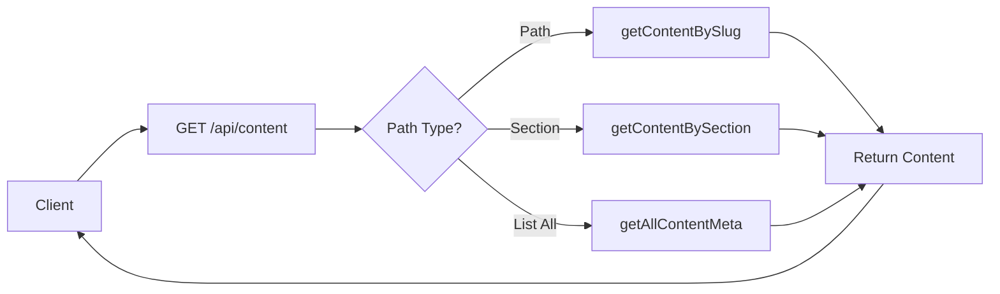
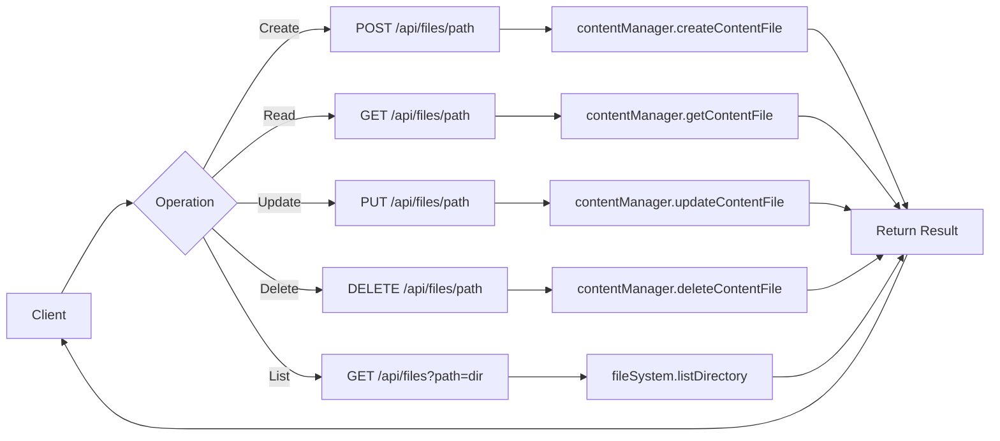
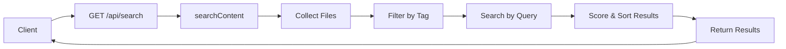

# Company Wiki Project Structure

This document outlines the structure of the Company Wiki project, providing an overview of its organization and key components.

## Directory Structure

```
/company-wiki
├── /content                # Wiki content in Markdown/MDX format
│   ├── /company-wiki       # Company information
│   ├── /hipaa              # HIPAA compliance documentation
│   └── /sop                # Standard operating procedures
├── /public                 # Static assets
├── /scripts                # Utility scripts
└── /src
    ├── /app                # Next.js App Router pages and API routes
    │   ├── /api            # REST API endpoints
    │   │   ├── /content    # Content retrieval API
    │   │   ├── /files      # File operations API
    │   │   ├── /search     # Search API
    │   │   └── /upload     # File upload API
    │   └── /wiki           # Wiki page routes
    ├── /components         # React components
    │   ├── /content        # Content display components
    │   ├── /hipaa          # HIPAA-specific components
    │   ├── /layout         # Layout components
    │   ├── /navigation     # Navigation components
    │   ├── /search         # Search components
    │   ├── /sidebar        # Sidebar components
    │   └── /theme          # Theming components
    ├── /lib                # Core library code
    │   ├── /api            # API utilities
    │   ├── /content        # Content processing (MDX, Markdown)
    │   ├── /files          # File system operations
    │   ├── /mock-data      # Mock data for development
    │   └── /search         # Search functionality
    ├── /styles             # Global styles
    └── /types              # TypeScript type definitions
```

## Key Components

### API Endpoints

- **/api/content** - Get content by path, section, or list all content
- **/api/files** - List, create, update, and delete files
- **/api/files/[...path]** - File operations on specific paths
- **/api/search** - Search content by query or tag
- **/api/upload** - Upload files to the content directory

### Library Modules

- **lib/api** - API response formatting and error handling
- **lib/content** - MDX and Markdown processing utilities
- **lib/files** - File system operations and content management
- **lib/search** - Content search functionality

### React Components

- **components/content/MDXContent** - Renders MDX content with frontmatter
- **components/layout/WikiLayout** - Main layout for wiki pages
- **components/navigation/Breadcrumb** - Navigation breadcrumbs
- **components/sidebar/Sidebar** - Wiki navigation sidebar

## Type Definitions

- **types/api.ts** - API request/response type definitions
- **types/content.ts** - Content-related type definitions

## Flow Diagrams

### Content Retrieval Flow



### File Operations Flow



### Search Flow



## Configuration Files

- **next.config.js** - Next.js configuration
- **tailwind.config.js** - Tailwind CSS configuration
- **postcss.config.js** - PostCSS configuration
- **eslint.config.js** - ESLint configuration
- **tsconfig.json** - TypeScript configuration

All configuration files are now stored directly in the root directory following standard Next.js best practices, making it easier for developers to find and modify them.

## Documentation

- **API.md** - API documentation
- **README.md** - Project overview and setup instructions
- **PROJECT_STRUCTURE.md** - Project structure documentation
