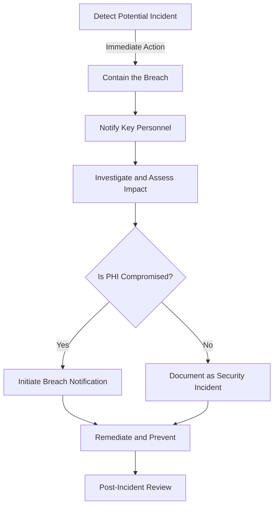

# Incident Response and Breach Protocols [MANDATORY]

## Overview
This page outlines the mandatory incident response and breach notification procedures that **must** be followed in the event of a security incident involving Protected Health Information (PHI). Timely and appropriate response to security incidents is a critical HIPAA requirement.

## Incident Response Flowchart

## Step 1: Detect and Contain the Breach [IMMEDIATE ACTION]

### Detection [MANDATORY]
- **Standard**: Early detection of potential security incidents
- **Implementation**: Monitoring, alerting, reporting mechanisms
- **Scope**: All systems containing PHI
- **Timeframe**: Immediate upon discovery

#### Detection Methods:
1. Automated system monitoring and alerts
2. Security log analysis
3. User/staff reporting of suspicious activity
4. Unusual system behavior
5. Reports of lost/stolen devices

#### Containment Actions [CRITICAL]:
1. Isolate affected systems from the network immediately
2. Revoke or change compromised user credentials
3. Block unauthorized access points
4. Preserve evidence (do NOT wipe systems or delete logs)
5. Document initial containment actions taken

#### Compliance Verification:
- [ ] Incident detected and logged
- [ ] Initial containment measures implemented
- [ ] Evidence preserved
- [ ] Initial documentation created
- [ ] Key personnel notified

## Step 2: Notification and Initial Response [WITHIN 1 HOUR]

### Internal Notification [MANDATORY]
- **Standard**: Prompt notification of key personnel
- **Implementation**: Established notification chain
- **Scope**: Security, compliance, and leadership teams
- **Timeframe**: Within 1 hour of discovery

#### Key Personnel to Notify:
1. Security Officer: [NAME] at [CONTACT]
2. Privacy Officer: [NAME] at [CONTACT]
3. Compliance Officer: [NAME] at [CONTACT]
4. Legal Counsel: [NAME] at [CONTACT]
5. Executive Leadership: [NAME] at [CONTACT]

#### Initial Response Actions:
1. Establish an incident response team
2. Assign roles and responsibilities
3. Create an incident-specific communication channel
4. Begin detailed documentation of the incident
5. Secure additional resources as needed

#### Compliance Verification:
- [ ] All key personnel notified
- [ ] Incident response team established
- [ ] Roles and responsibilities assigned
- [ ] Communication channel established
- [ ] Documentation process initiated

## Step 3: Investigate and Assess Impact [WITHIN 24 HOURS]

### Investigation [MANDATORY]
- **Standard**: Thorough investigation of the incident
- **Implementation**: Forensic analysis, log review, interviews
- **Scope**: All potentially affected systems and data
- **Timeframe**: Initial assessment within 24 hours

#### Investigation Actions:
1. Determine the cause of the incident (attack vector, vulnerability)
2. Identify all affected systems and data
3. Determine if PHI was accessed, acquired, used, or disclosed
4. Identify which patients' PHI may have been compromised
5. Document the timeframe of the incident

#### Impact Assessment:
1. Determine the type of PHI involved (medical records, billing info, etc.)
2. Assess the number of individuals affected
3. Evaluate whether PHI was actually acquired or viewed
4. Determine the potential harm to affected individuals
5. Assess if the PHI was returned or destroyed (if applicable)

#### Compliance Verification:
- [ ] Cause of incident determined
- [ ] Affected systems and data identified
- [ ] PHI impact assessed
- [ ] Number of affected individuals determined
- [ ] Investigation documentation completed

## Step 4: Breach Notification [IF PHI WAS COMPROMISED]

### Breach Determination [MANDATORY]
- **Standard**: Determine if the incident constitutes a breach
- **Implementation**: Apply breach definition and exceptions
- **Scope**: All incidents involving PHI
- **Timeframe**: Within 48 hours of discovery

#### Breach Definition:
A breach is the acquisition, access, use, or disclosure of PHI in a manner not permitted by the HIPAA Privacy Rule that compromises the security or privacy of the PHI.

#### Exceptions (Not a Breach):
1. Unintentional acquisition, access, or use by workforce member acting in good faith
2. Inadvertent disclosure by authorized person to another authorized person
3. Good faith belief that unauthorized recipient could not reasonably retain the information
4. PHI was encrypted according to HHS guidance (and keys not compromised)

#### Notification Requirements:
1. As a Business Associate, notify the covered entity without unreasonable delay and no later than 60 days from discovery
2. Provide all relevant information about the breach
3. Assist the covered entity in meeting their notification obligations
4. Document all notifications made

#### Compliance Verification:
- [ ] Breach determination completed
- [ ] Covered entity notified (if applicable)
- [ ] Notification documentation completed
- [ ] Assistance provided to covered entity
- [ ] Breach log updated

## Step 5: Remediation and Prevention [ONGOING]

### Remediation [MANDATORY]
- **Standard**: Address the root cause and vulnerabilities
- **Implementation**: Technical fixes, policy updates, training
- **Scope**: All affected systems and processes
- **Timeframe**: Begin immediately, complete based on severity

#### Remediation Actions:
1. Fix the technical vulnerability or issue that allowed the breach
2. Restore systems from clean backups if necessary
3. Implement additional security controls to prevent recurrence
4. Update policies and procedures based on lessons learned
5. Conduct targeted training for staff if human error was involved

#### Prevention Measures:
1. Conduct a comprehensive review of security controls
2. Update risk assessment based on the incident
3. Implement additional monitoring or alerting
4. Enhance encryption or access controls if needed
5. Review and update the incident response plan based on lessons learned

#### Compliance Verification:
- [ ] Root cause addressed
- [ ] Systems restored to secure state
- [ ] Additional security controls implemented
- [ ] Policies and procedures updated
- [ ] Staff training conducted (if applicable)

## Step 6: Documentation and Reporting [MANDATORY]

### Incident Documentation [MANDATORY]
- **Standard**: Comprehensive documentation of the incident
- **Implementation**: Detailed incident report
- **Scope**: All aspects of the incident and response
- **Timeframe**: Complete within 10 days of incident closure

#### Documentation Requirements:
1. Timeline of events (discovery, containment, investigation, notifications, remediation)
2. Root cause analysis
3. List of affected data/individuals
4. Corrective actions taken
5. Evidence of notifications made

#### Reporting Requirements:
1. Internal incident report for leadership and compliance
2. Documentation for covered entity (if business associate)
3. Documentation for regulatory reporting (if required)
4. Update breach log with incident details
5. Retain all documentation for at least 6 years

#### Compliance Verification:
- [ ] Comprehensive incident report completed
- [ ] All required documentation compiled
- [ ] Reports distributed to appropriate parties
- [ ] Breach log updated
- [ ] Documentation securely archived

## Step 7: Post-Incident Review [WITHIN 30 DAYS]

### Post-Incident Analysis [MANDATORY]
- **Standard**: Learn from the incident to improve security
- **Implementation**: Formal review meeting and report
- **Scope**: Incident response team and leadership
- **Timeframe**: Within 30 days of incident closure

#### Review Process:
1. Conduct a post-incident review meeting
2. Analyze what went well and what could be improved
3. Identify security gaps that need to be addressed
4. Update the incident response plan based on lessons learned
5. Document recommendations for preventing similar incidents

#### Continuous Improvement:
1. Implement recommended security improvements
2. Update training materials based on lessons learned
3. Conduct tabletop exercises to practice response to similar incidents
4. Review and update risk assessment
5. Share sanitized lessons learned with the team

#### Compliance Verification:
- [ ] Post-incident review meeting conducted
- [ ] Lessons learned documented
- [ ] Incident response plan updated
- [ ] Security improvements implemented
- [ ] Risk assessment updated

## Breach Notification Requirements

### Business Associate Obligations
As a Business Associate, we must:
1. Notify the covered entity of a breach without unreasonable delay and no later than 60 days from discovery
2. Provide the covered entity with:
   - Identification of individuals affected
   - Description of what happened
   - Types of PHI involved
   - Steps individuals should take to protect themselves
   - What we are doing to investigate, mitigate, and prevent future breaches
3. Provide any additional information requested by the covered entity
4. Assist the covered entity in meeting their notification obligations

### Covered Entity Obligations (For Reference)
The covered entity must:
1. Notify affected individuals without unreasonable delay and no later than 60 days from discovery
2. For breaches affecting 500+ individuals, notify HHS and prominent media outlets
3. For breaches affecting fewer than 500 individuals, maintain a log and submit to HHS annually
4. Include specific content in notifications as required by the Breach Notification Rule

## Incident Response Team and Responsibilities

| Role | Primary Responsibilities | Secondary Responsibilities |
|------|--------------------------|----------------------------|
| Incident Response Lead | Overall coordination of response | Final incident report |
| Security Officer | Technical investigation and containment | Security improvements |
| Privacy Officer | PHI impact assessment | Breach determination |
| Legal Counsel | Legal and regulatory guidance | Notification requirements |
| Communications Lead | Internal/external communications | Media response (if needed) |
| IT/Technical Lead | System restoration and remediation | Technical evidence collection |

## Related Documentation
- [Technical Security Standards](/wiki/hipaa/documentation/technical-security)
- [Access Control & Authentication](/wiki/hipaa/documentation/access-control)
- [CCM Requirements](/wiki/hipaa/documentation/ccm-specific-requirements)

## Regulatory References
- HIPAA Breach Notification Rule (45 CFR §§ 164.400-414)
- HIPAA Security Rule § 164.308(a)(6) - Security Incident Procedures
- HITECH Act § 13402 - Notification in the Case of Breach